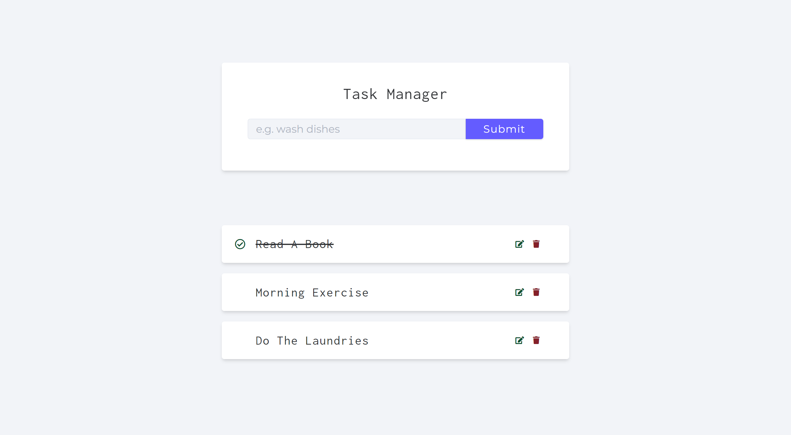

# Task Manager API

This is a simple API project to hone my golang skills using Gin web framework and GORM

1. [**Gin Framework**](https://gin-gonic.com/) - Full-featured web framework for Go
2. [**Gorm**](https://gorm.io/index.html) - ORM library for Golang

## Installation & Run

```bash
# Navigate to task-manager-be
$ cd task-manager-be

# Download all necessary packages
$ go get

# Start server
$ go run .
```

## Screenshot



## API

#### /api/v1/tasks

- `GET` : Get all tasks
- `POST` : Create a new task

#### /api/v1/tasks/:id

- `GET` : Get a task
- `PATCH` : Update a task
- `DELETE` : Delete a task

### Post Params

```
{
    "name": "John Doe", // Required
}
```

### Patch Params

```
{
    "name": "Jane Doe", // Optional
    "completed": true // Optional
}
```
